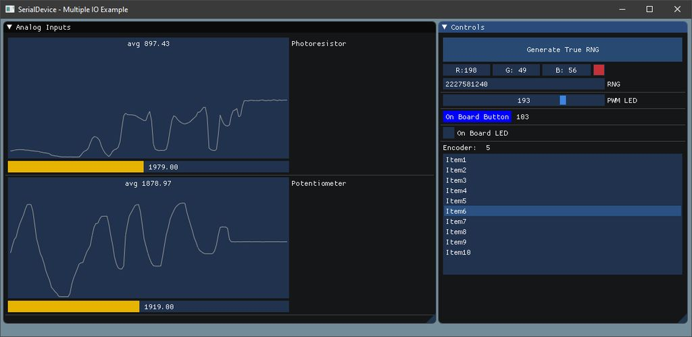
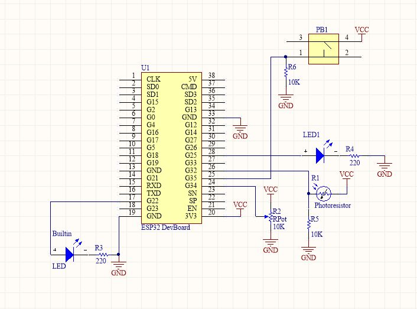
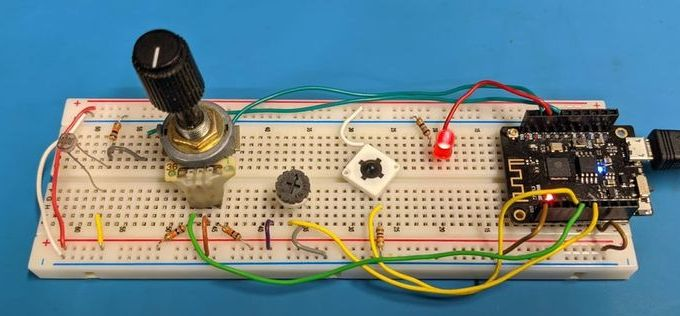

# SerialDevice_Advanced_Example
Advanced Examples of the SerialDevice

**Examples**
-

[Multiple IO Data Example](SerialDevice_Multiple_IO/) - Shows how to have multiple inputs and outputs operating simultaneously.

This example is designed to run on an ESP32 for the peripheral side.

The Host side runs cross platform: Windows, Linux, OSX

[Build Instructions](#build-instructions)

The following dependencies are used:
* [ImGui - 1.7.5](https://github.com/ocornut/imgui/tree/v1.75) (Included in the [thrid-party](SerialDevice_Multiple_IO/Host_App/third-party/) directory of this project)
* [SerialDevicePeripheral Library](https://github.com/circuitsforfun/SerialDevicePeripheral)
* [SerialDeviceHost Library](https://github.com/circuitsforfun/SerialDeviceHost)
* On Linux and OSX the follow dependecies are also needed:
    * OpenGL, GLFW3, GLEW

###### Features:
* Stream analog inputs and graph values over time, show average value and current value
* Encoder knob for rotary input, show counter and use as list box selector
* Physical push button for user input, show button press counter
* UI Slider to control LED PWM value for LED intensity
* Checkbox toggle on/off for secondary on board LED
* UI Button to use ESP32 True Random Number Generator, show raw value and use first three byte for random RGB Color

###### Interface:

###### Schematic:

###### Breadboard Setup:

###### Video:

## Build Instructions

Clone or download the repo

**ESP32** - Open Multiple_IO_Device.ino in the arduino IDE, build and upload to your ESP32

_(Make sure you have the [SerialDevicePeripheral Library](https://github.com/circuitsforfun/SerialDevicePeripheral) installed)_  

**Host App:**
1. Make a build directory
2. On Windows you can use the CMake GUI if preferred (Specify the location of the SerialDeviceHost Library)
3. Otherwise CD to build dir
4. cmake ../ -DSerialDeviceHost_DIR=\<path to SerialDeviceHost Library>
5. build

